<div align="center">

# 📦 Solar Parcel Receiving Box


**An intelligent, solar-powered parcel receiving box with real-time notifications**

[Features](#-features) • [Hardware](#-hardware-requirements) • [Installation](#-installation) • [Usage](#-usage) • [Circuit](#-circuit-diagram) • [Gallery](#-gallery)

---

</div>

## 📋 Table of Contents

- [Overview](#-overview)
- [Features](#-features)
- [Hardware Requirements](#-hardware-requirements)
- [Software Requirements](#-software-requirements)
- [Installation](#-installation)
- [Usage](#-usage)
- [Circuit Diagram](#-circuit-diagram)
- [Gallery](#-gallery)
- [Project Structure](#-project-structure)
- [Contributing](#-contributing)
- [License](#-license)
- [Author](#-author)

---

## 🌟 Overview

The **Solar Parcel Receiving Box** is an innovative IoT solution that automatically detects when parcels are delivered to your mailbox and sends instant notifications to your LINE messaging app. Powered by solar energy, this smart parcel box ensures you never miss a delivery, even in remote locations without direct power access.

### Key Highlights

- ☀️ **Solar-Powered**: Fully autonomous operation using 18W solar panel with battery backup
- 📱 **Real-Time Notifications**: Instant LINE notifications when parcels arrive
- 🔢 **Parcel Counter**: Tracks and stores parcel count in EEPROM memory
- 🚪 **Door Sensor**: Detects when the box is opened and resets counter
- 📶 **WiFi Manager**: Easy WiFi configuration without hardcoding credentials
- 🔋 **Battery Backup**: 12V DC battery ensures continuous operation

---

## ✨ Features

### Core Functionality

- **Automatic Parcel Detection**: Uses IR sensors to detect when parcels are placed in the box
- **Smart Counter System**: Maintains parcel count even after power loss using EEPROM
- **Door Monitoring**: Detects door opening and automatically resets counter when empty
- **LINE Integration**: Sends rich notifications with images and stickers via LINE Notify API
- **WiFi Auto-Connect**: Automatic WiFi configuration with fallback to access point mode
- **Reset Functionality**: Hardware button to reset WiFi settings

### Notification Features

- 📬 Welcome message on system startup
- 📦 Parcel arrival notification with count
- 🚪 Door open notification when box is emptied
- 🎨 Rich media support (images and stickers)

---

## 🔧 Hardware Requirements

### Main Components

| Component | Specification | Quantity |
|-----------|--------------|----------|
| **Microcontroller** | NodeMCU V.3 ESP8266 | 1 |
| **IR Sensor** | Infrared Obstacle Sensor | 2 |
| **Solar Panel** | 18W Solar Cell | 1 |
| **Solar Charger** | PWM Solar Charge Controller | 1 |
| **Battery** | 12V DC Battery | 1 |
| **Parcel Box** | Weather-resistant cabinet | 1 (optional) |
| **Reset Button** | Tactile switch | 1 |

### Pin Configuration

| ESP8266 Pin | Function | Description |
|-------------|----------|-------------|
| D0 (GPIO16) | Reset WiFi | Button input |
| D1 (GPIO5) | Mail Sensor | IR sensor input |
| D2 (GPIO4) | Door Sensor | IR sensor input |
| D4 (GPIO2) | Output | General purpose |

---

## 💻 Software Requirements

### Arduino IDE

- **Version**: 1.8.x or later
- **Download**: [Arduino IDE](https://www.arduino.cc/en/software)

### Required Libraries

Install the following libraries via Arduino Library Manager:

1. **EEPROM** (Built-in)
   - Used for storing parcel counter data

2. **TridentTD_LineNotify**
   - LINE Notify API integration
   - Install: `Tools` → `Manage Libraries` → Search "TridentTD_LineNotify"

3. **WiFiManager**
   - Automatic WiFi configuration
   - Install: `Tools` → `Manage Libraries` → Search "WiFiManager"

4. **DNSServer**
   - Required by WiFiManager
   - Install: `Tools` → `Manage Libraries` → Search "DNSServer"

### Board Settings

1. Go to `File` → `Preferences`
2. Add ESP8266 board URL: `http://arduino.esp8266.com/stable/package_esp8266com_index.json`
3. Go to `Tools` → `Board` → `Boards Manager`
4. Search and install "ESP8266"
5. Select: `Tools` → `Board` → `NodeMCU 1.0 (ESP-12E Module)`
6. Set upload speed to `115200`

---

## 🚀 Installation

### Step 1: Clone the Repository

```bash
git clone https://github.com/MrPatchara/Solar_Parcel_Receiving_Box.git
cd Solar_Parcel_Receiving_Box
```

### Step 2: Install Libraries

Open Arduino IDE and install all required libraries mentioned in [Software Requirements](#-software-requirements).

### Step 3: Configure LINE Token

1. Open `Source code/Solar-Parcel-Box/Solar-Parcel-Box.ino`
2. Get your LINE Notify token from [LINE Notify](https://notify-bot.line.me/)
3. Replace the token in the code:

```cpp
#define LINE_TOKEN  "YOUR_LINE_NOTIFY_TOKEN_HERE"
```

### Step 4: Upload Code

1. Connect your NodeMCU to your computer via USB
2. Select the correct COM port in Arduino IDE
3. Click `Upload` button
4. Wait for upload to complete

### Step 5: Hardware Assembly

1. Connect IR sensors to D1 and D2 pins
2. Connect reset button to D0 pin
3. Connect solar panel to charge controller
4. Connect battery to charge controller
5. Connect ESP8266 power to battery (via appropriate voltage regulator)

---

## 📖 Usage

### Initial Setup

1. **Power On**: Connect the solar panel and battery
2. **WiFi Configuration**: 
   - On first boot, the device creates a WiFi access point named "Inw Parcel Receiving Box"
   - Connect to this network with your smartphone
   - A configuration page will open automatically
   - Enter your WiFi credentials
3. **Confirmation**: You'll receive a LINE notification confirming successful WiFi connection

### Normal Operation

- **Parcel Detection**: When a parcel is placed in the box, the IR sensor triggers
- **Notification**: You'll receive a LINE notification with parcel count
- **Door Opening**: When you open the door to retrieve parcels, the counter resets
- **Empty Box**: You'll receive a notification confirming the box is empty

### Resetting WiFi

- Press and hold the reset button (D0) to reset WiFi settings
- The device will create a new access point for reconfiguration

---

## 🔌 Circuit Diagram

### Main Circuit

<div align="center">

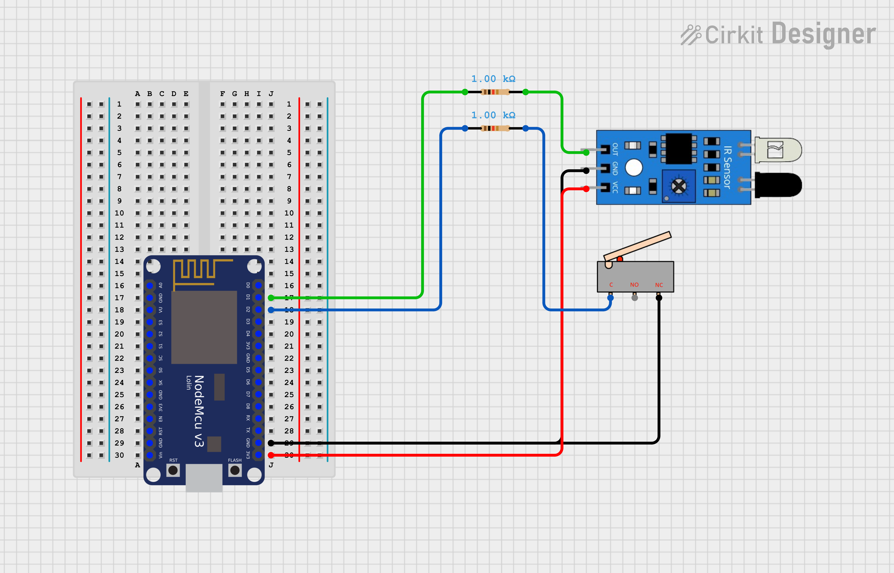
*Main Circuit Overview*

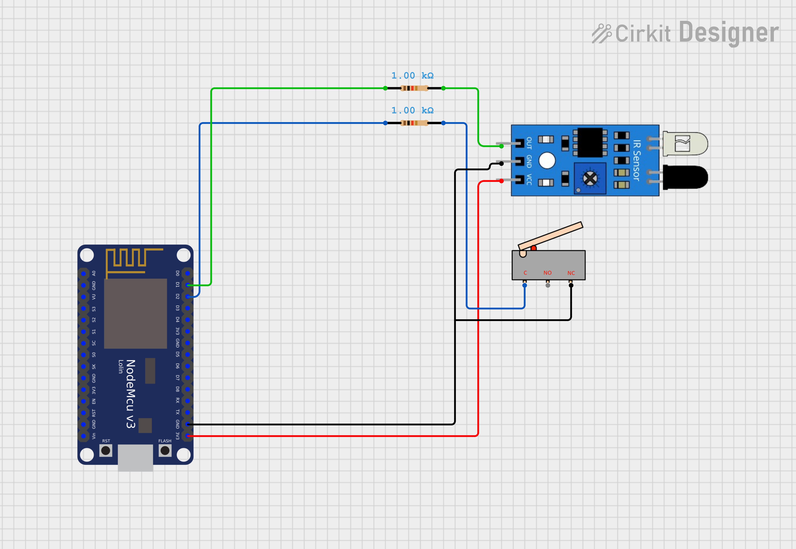
*ESP8266 Connection Details*

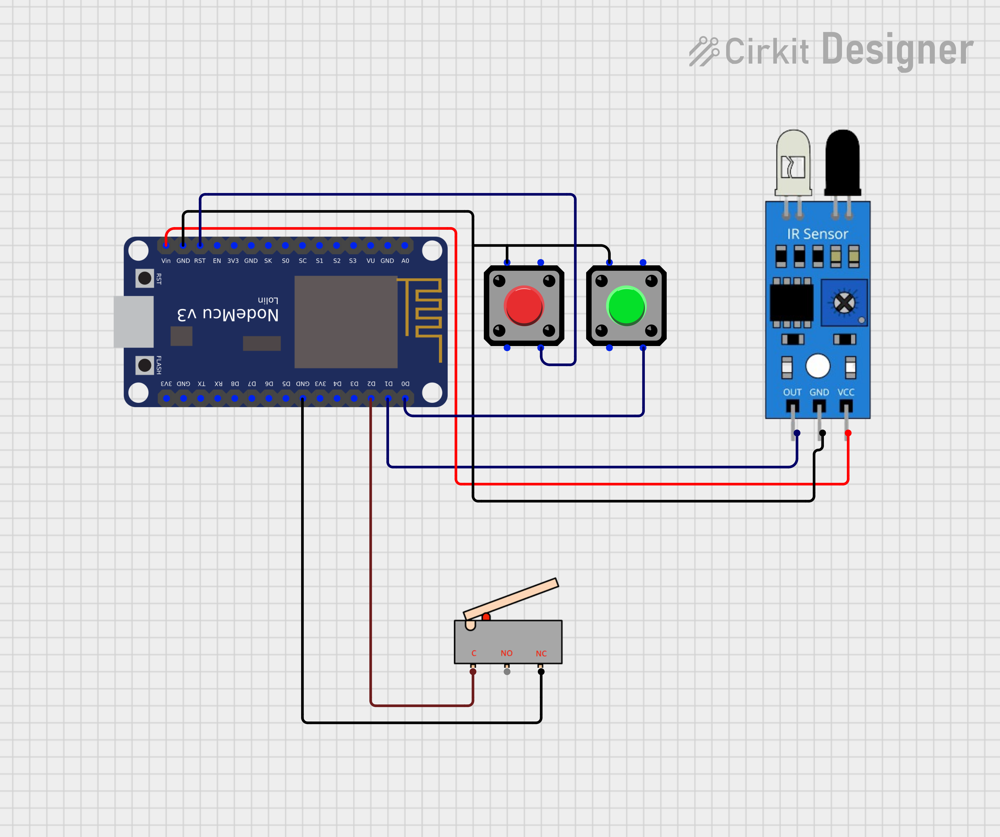
*Solar Panel Integration*

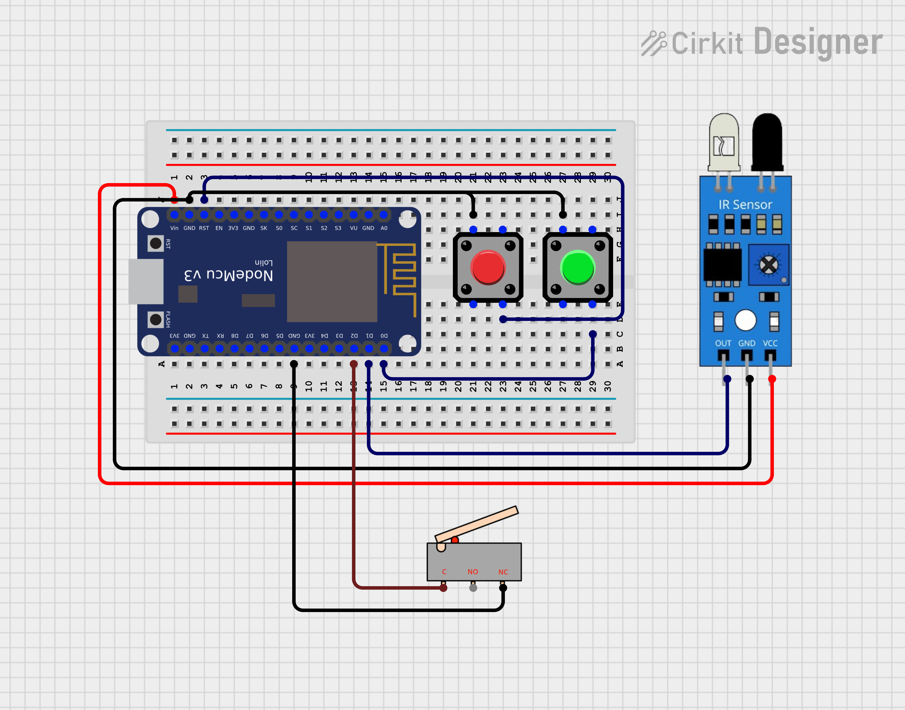
*Complete System Wiring*


*Solar Cell to ESP8266 Connection*

</div>

### Circuit Files

- `Circuit/esp8266.ckt` - ESP8266 circuit design
- `Circuit/solar.ckt` - Solar charging circuit design

---

## 📸 Gallery

### Project Images

<div align="center">

<table>
<tr>
<td align="center">
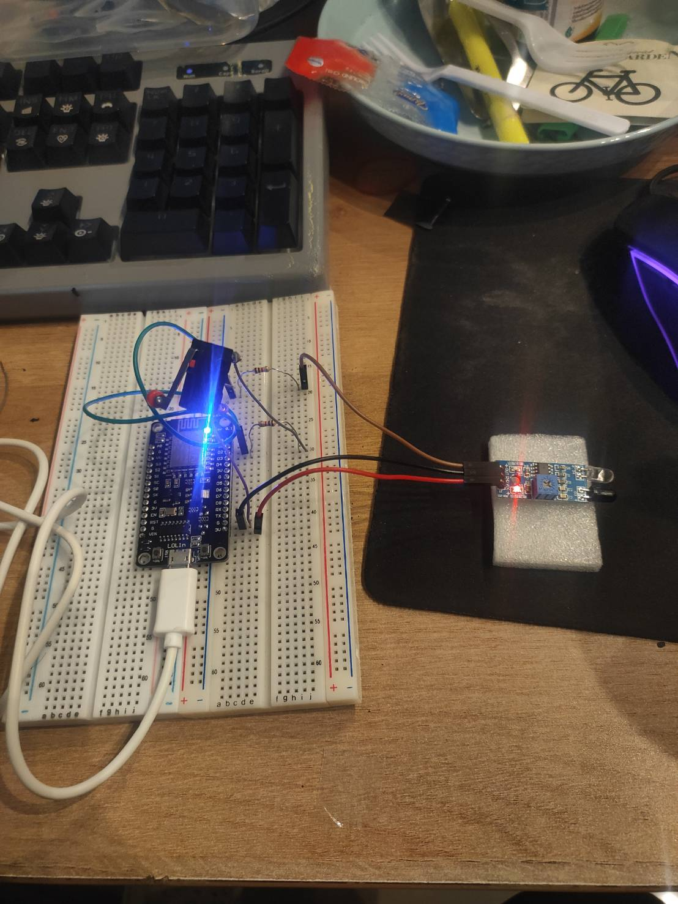
<br/><sub>Project Overview</sub>
</td>
<td align="center">
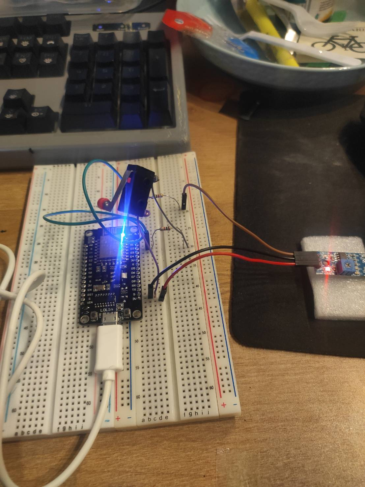
<br/><sub>Solar Panel Setup</sub>
</td>
<td align="center">
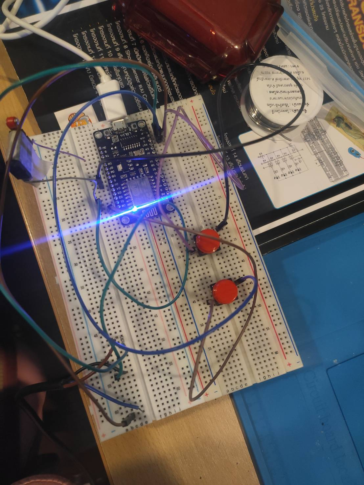
<br/><sub>Internal Components</sub>
</td>
</tr>
<tr>
<td align="center">

<br/><sub>ESP8266 Module</sub>
</td>
<td align="center">
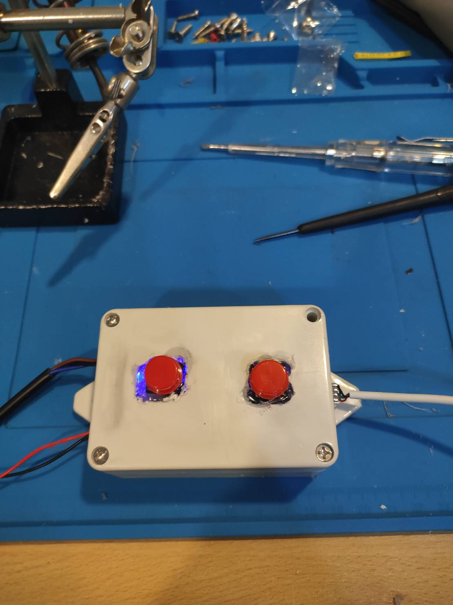
<br/><sub>Sensor Installation</sub>
</td>
<td align="center">
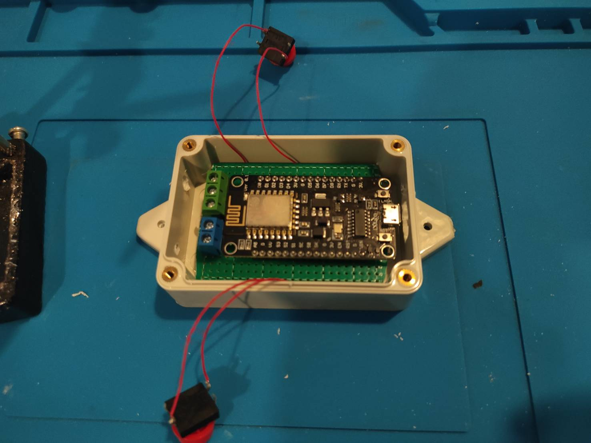
<br/><sub>Battery System</sub>
</td>
</tr>
<tr>
<td align="center">
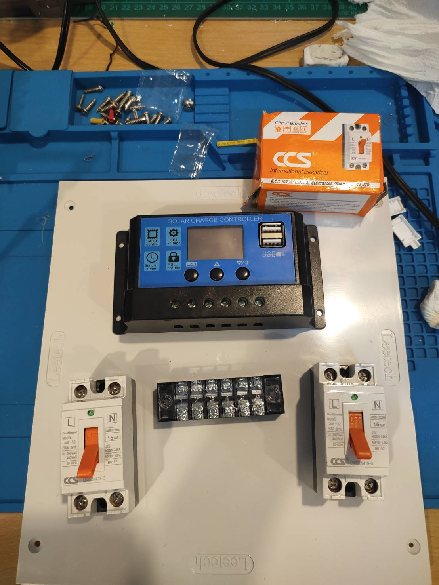
<br/><sub>Complete Assembly</sub>
</td>
<td align="center">
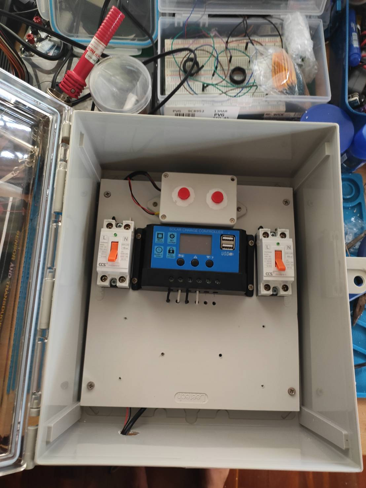
<br/><sub>Final Product</sub>
</td>
<td align="center">
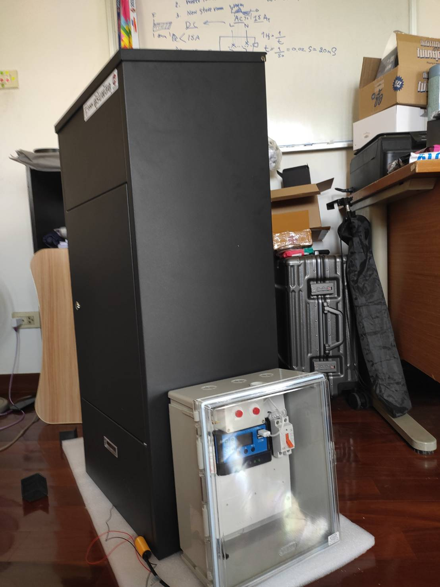
<br/><sub>In Action</sub>
</td>
</tr>
</table>

</div>

### Video Demonstration

<div align="center">

🎥 **[Watch Video Test](pic/Video-Test.mp4)**

*Click to view the project in action!*

</div>

---

## 📁 Project Structure

```
Solar_Parcel_Receiving_Box/
│
├── 📁 Circuit/                    # Circuit diagrams and schematics
│   ├── 1.png                      # Main circuit diagram
│   ├── 2.png                      # ESP8266 connections
│   ├── 3.png                      # Solar integration
│   ├── 4.png                      # Complete wiring
│   ├── esp8266.ckt                # ESP8266 circuit file
│   ├── solar.ckt                  # Solar circuit file
│   └── solarcell to esp8266.png   # Solar to ESP8266 connection
│
├── 📁 Source code/                 # Arduino source code
│   └── Solar-Parcel-Box/
│       ├── Solar-Parcel-Box.ino   # Main code (LINE Notify)
│       └── V2.ino                  # Alternative version (Telegram)
│
├── 📁 NewParcel_update22-11-2025/  # Updated versions
│   ├── NewParcel.ino
│   ├── sketch_nov22a/
│   └── update/
│
├── 📁 pic/                         # Project images and videos
│   ├── *.jpg                       # Project photos
│   ├── images.png                  # Additional images
│   └── Video-Test.mp4              # Demonstration video
│
├── 📄 README.md                    # This file
└── 📄 LICENSE                      # MIT License
```

---

## 🤝 Contributing

Contributions are welcome! If you'd like to contribute to this project:

1. **Fork** the repository
2. **Create** a feature branch (`git checkout -b feature/AmazingFeature`)
3. **Commit** your changes (`git commit -m 'Add some AmazingFeature'`)
4. **Push** to the branch (`git push origin feature/AmazingFeature`)
5. **Open** a Pull Request

### Ideas for Contribution

- 📱 Add support for other notification platforms (Telegram, WhatsApp)
- 📊 Create a web dashboard for parcel tracking
- 🔋 Improve battery monitoring and reporting
- 🌐 Add MQTT support for home automation integration
- 📷 Add camera module for parcel photos
- 🔔 Add buzzer for local alerts

---

## 📄 License

This project is licensed under the **MIT License** - see the [LICENSE](LICENSE) file for details.

---

## 👤 Author

<div align="center">

### นายพัชระ อัลอุมารี (Mr. Patchara Al-Umari)

[](https://github.com/MrPatchara)

**Solar Parcel Receiving Box v1.0**

*An innovative IoT solution for smart parcel management*

---

<div align="center">

### ⭐ If you find this project helpful, please give it a star! ⭐

Made with ❤️ and ☀️

</div>
